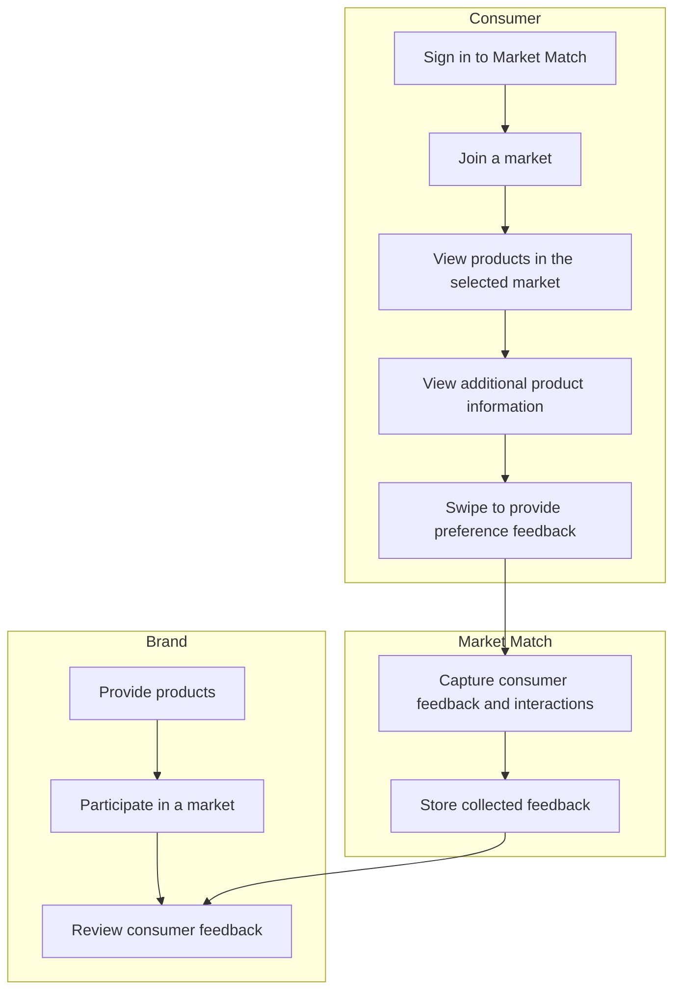
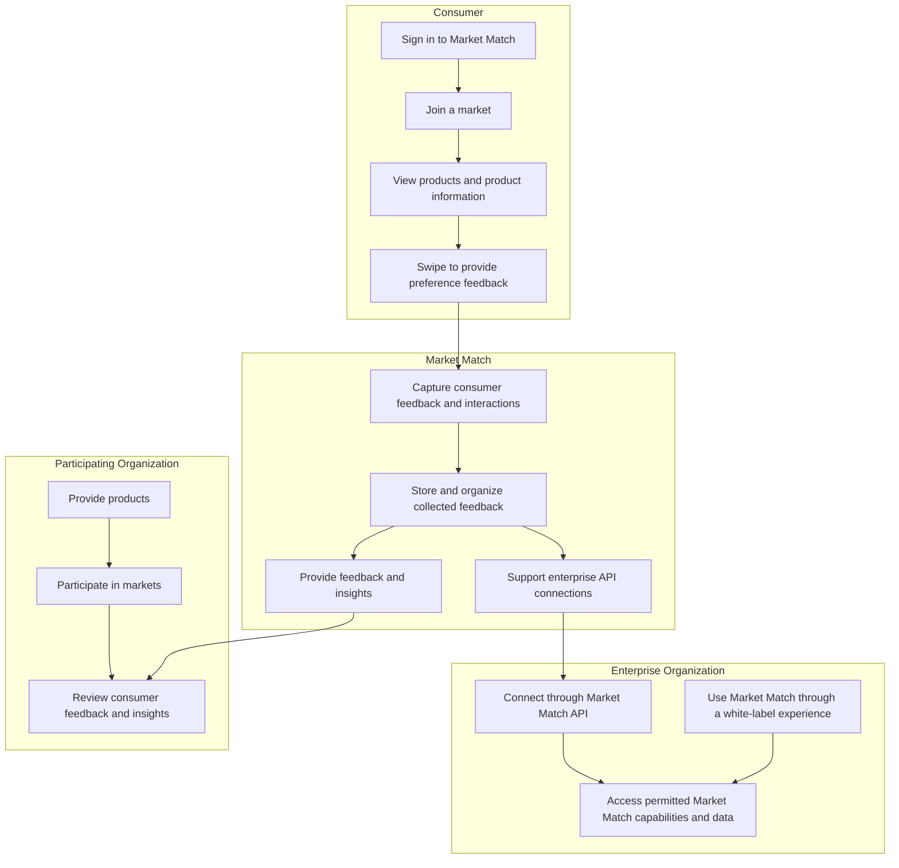
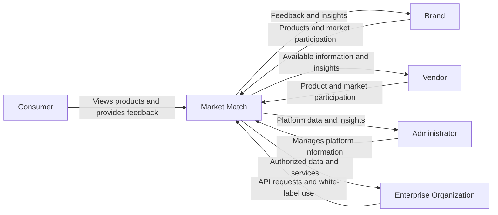

# Vision and Scope

**Project:** Market Match
**Team:** Team 11
**Client:** Demetrie King
**Version:** 0.1

---

_**How to use this template.** Every section below opens with an instruction in italic square brackets: what the section is for, how to produce it, a worked example, and a checklist. Fill in the section underneath the instruction. **Leave the instructions in the file until the document is stable.** They are context for you, for the teammate who writes a later section, and for your AI teammate, which reads this file every time it works on your project._

_**This document has two readers.** Your client has to recognize their own business in it, so avoid jargon they would not use. Your AI teammate has to build from it, so avoid a claim it cannot check. When the two pull against each other, write for the client and put the precision in the use cases._

_**Work it with your agent, not instead of it.** Give the agent this template, your one-page project brief, and your meeting notes, then put it in a role: "You are an experienced business analyst. Using the instructions in this template, draft section X, and list every question you cannot answer from what I gave you." The questions it cannot answer are the point. They go in [OPEN-ISSUES.md](OPEN-ISSUES.md) and they become the agenda for your next client meeting. What the agent cannot do is decide which of its questions deserve your client's limited time, or tell enthusiasm apart from commitment. That judgment is yours._

## Identifiers in this document

_Identifiers here are **name-based slugs**, never numbers._

| Space | Shape | Example |
|---|---|---|
| Business objective | `BO-<slug>` | `BO-grading-time` |
| Success metric | `SM-<slug>` | `SM-submission-rate` |
| Risk | `RI-<slug>` | `RI-cloud-cost` |
| Assumption or dependency | `AS-<slug>` | `AS-client-maintains-stack` |
| Feature | `FEAT-<slug>` | `FEAT-performance-tracking` |

_Coin each slug from the concept itself: short, kebab-case, unique within its space. **Never renumber, rename, or repoint an identifier.** A new item gets a new slug; a retired item keeps its slug and is marked withdrawn. Cite items by identifier, never by position in a list ("the third objective")._

_Why this matters more with an agent than it used to: ask an agent to insert a new objective into a list numbered `BO-1` through `BO-6` and it has two options. Renumber everything, silently breaking every citation in your use cases and your specification, or append out of order. No test you can write detects either one. A slug has neither failure mode, and it tells a reader what the item is at the place it is cited._

## Revision History

| Date | Version | Description | Author |
|---|---|---|---|
| _[2026-09-11]_ | 0.1 | Initial draft from the client brief and first client meeting | _[Kritika Karanjit]_ |

---

## 1. Introduction

_[This document defines the goals, purpose, and boundaries of the project. It gives every stakeholder a shared understanding of what the software is for and the context it operates in: the business problem being solved, how the software fits into the client's world, and where the line falls between what is in scope and what is not.]_

### 1.1 Background

Market Match is an existing swipe-based marketing and consumer feedback platform designed to make market research more interactive. The platform connects consumers with products and allows organizations to collect preference and interaction data. Consumers can access a market and swipe through products to indicate interest or disinterest, while participating organizations can use the resulting feedback to better understand consumer preferences.

An MVP of Market Match already exists and recorded approximately 3,600 swipes at the most recent I-Fest. Market Match is beginning to expand to additional colleges and is working with TCU to gather feedback about what students would like to see at events.

The client wants Market Match to grow beyond a traditional survey platform into a broader marketing platform where organizations can collect consumer feedback about products and ideas, including products that have not yet been released. The longer-term vision also includes supporting enterprise organizations through white-label instances and API connections. As Market Match expands, the existing platform will need to support additional users, organizations, and collected data while maintaining a reliable user experience.

### 1.2 Current Process Flows (As-Is Process Flows)


The current Market Match process connects consumers with products through participating markets. Consumers sign in to Market Match, join a market, and view products available within that market. They can view additional product information and swipe to provide preference feedback. Market Match captures and stores the resulting consumer interactions and feedback. Participating brands can provide products, participate in markets, and use the collected feedback to better understand consumer interest.
Market Match already provides the primary software used for this process, so the project focuses on improving an existing platform rather than replacing a manual process. The current platform supports the core swipe-based feedback experience. As Market Match expands to additional colleges and organizations, the platform will need to support additional users, markets, products, and collected feedback while maintaining a reliable user experience.

### 1.3 References

- **Market Match Project Brief** — Provided by client Demetrie King to Team 11. Available through TCU Online.

- **Market Match First Client Meeting Notes (`client-meeting-1.md`)** — Meeting with client Demetrie King, September 7, 2026. Available in the Team 11 GitHub repository.

## 2. Business Requirements

_[Projects are launched in the belief that creating or changing a product will provide worthwhile benefits for someone. Business requirements describe the primary benefits the new system will provide to its sponsors, buyers, and users. Input comes from the people who know **why** the project is being undertaken: your client, their management, a subject matter expert, a product visionary. Business requirements determine which user requirements get implemented and in what order, so take this section seriously.]_

### 2.1 Business Opportunity or Problem Statement

_[State the problem being solved or the opportunity being exploited, in the client's own terms. One or two paragraphs. This is the answer to "why is anyone paying for this?"]_

Market Match has an opportunity to provide companies and organizations with a more interactive way to collect consumer feedback. Instead of relying only on traditional surveys, Market Match allows consumers to swipe through products and indicate their preferences while the platform captures feedback and interaction data.

As Market Match expands to additional colleges and organizations, the existing platform needs to support increasing numbers of users, products, markets, and collected feedback while maintaining a reliable user experience. The client's longer-term vision also includes expanding Market Match to enterprise organizations through white-label instances and API-based integrations.

### 2.2 Business Objectives

_[Summarize the business benefits the product will provide, **quantitatively and measurably**. Platitudes ("become recognized as a world-class provider") and vague improvements ("provide a more rewarding customer experience") are neither helpful nor verifiable.]_

- `BO-platform-scalability`: Support growth in Market Match users, products, markets, and collected feedback while maintaining application stability. A specific capacity and performance target has not yet been provided by the client.

- `BO-user-engagement`: Improve the Market Match experience so consumers can easily interact with products and provide useful preference feedback. A specific engagement or completion target has not yet been provided by the client.

- `BO-enterprise-expansion`: Support Market Match's longer-term expansion to enterprise organizations through white-label instances and API-based integrations. A target number of enterprise organizations and completion date have not yet been provided.

### 2.3 Success Metrics

- `SM-platform-stability`: Measure whether Market Match remains stable and usable as the number of users, products, markets, and collected interactions increases. The current baseline capacity and acceptable performance target have not yet been provided by the client.

- `SM-user-engagement`: Measure consumer participation through interactions such as completed swipes and continued use of the product feedback experience. A baseline and target level of consumer engagement have not yet been provided by the client.

- `SM-enterprise-readiness`: Measure whether Market Match supports the capabilities needed for future enterprise use, including white-label and API-based integration capabilities identified by the client. Specific acceptance criteria and a target date have not yet been confirmed.

### 2.4 Vision Statement

_[One statement summarizing, at the highest level, the position this product intends to fill. Fill in the table.]_

| | |
|---|---|
| **For** | _[target customer]_ |
| **Who** | _[the need or opportunity]_ |
| **The** _[product name]_ | _[is a ...]_ |
| **That** | _[major capabilities, key benefit, compelling reason to use it]_ |
| **Unlike** | _[the current process, or the competing alternative]_ |
| **Our product** | _[primary differentiation and advantage]_ |

_Worked example:_

| | |
|---|---|
| **For** | _students in the TCU senior design course_ |
| **Who** | _need an easier way to submit and update weekly activity reports and peer evaluations_ |
| **The** _Project Pulse_ | _is a web application_ |
| **That** | _lets students submit reports and evaluations in one place, and lets instructors view and grade them without downloading anything_ |
| **Unlike** | _the current process of spreadsheets and manual uploads to the learning management system_ |
| **Our product** | _keeps the whole cycle in one system, so nothing is transcribed by hand_ |

_**Use this in the meeting.** Read the filled-in table back to your client out loud and watch what they correct. It is the fastest way to discover you misunderstood the project, and it costs ninety seconds. Corrections go straight into [OPEN-ISSUES.md](OPEN-ISSUES.md)._


| | |
|---|---|
| **For** | consumers, brands, and organizations seeking consumer feedback |
| **Who** | need an interactive way to provide and collect consumer preference feedback |
| **The** *Market Match* | *is a swipe-based marketing and consumer feedback platform* |
| **That** | allows consumers to interact with products and provide preference data that brands and markets can use to understand consumer interests |
| **Unlike** | traditional survey-based methods of collecting consumer feedback |
| **Our product** |  provides an interactive swipe-based experience that makes providing feedback simple for consumers while giving participating organizations useful consumer preference data |


### 2.5 Proposed Process Flows (To-Be Process Flows)

_[Draw the improved process, with your software in it, as a second mermaid flowchart in the same shape as the as-is flow. Show how the software interacts with each actor, which steps it automates, and which pain point from section 1.2 each change addresses. Label the steps that are new or significantly changed, and say plainly which manual steps **remain** and why. There may be several major flows.]_

_The point of drawing both is the comparison. If the two diagrams look alike, either you have not understood the current process or the software is not worth building._

### 2.5 Proposed Process Flows (To-Be Process Flows)



The proposed process builds on Market Match's existing swipe-based consumer feedback experience. Consumers will continue to join markets, view products, and provide preference feedback through swipes. Market Match will capture and organize these interactions so participating organizations can review feedback and better understand consumer interests.

The proposed process also expands Market Match for enterprise use. Enterprise organizations will be able to connect with Market Match through API-based integrations and use white-label versions of the platform. This extends the existing feedback process beyond the current Market Match experience and allows the platform to support organizations with different integration and branding needs.

The core consumer feedback process remains in place because swiping on products is a central part of Market Match. The proposed changes focus on expanding how organizations can use the platform and improving its ability to support broader adoption.

#### 2.6 Risks

- `RI-low-user-engagement`: Consumers may not provide enough product interactions and feedback for participating organizations to gain useful insights from Market Match. Low participation could reduce the value of the platform to organizations. (Probability 0.4, Impact 8) Mitigation: Continue gathering user feedback and improve the consumer experience to encourage participation.

- `RI-growth-stability`: Growth in users, products, markets, and collected interaction data may place additional demand on the platform and affect its performance or reliability. (Probability 0.5, Impact 8) Mitigation: Evaluate the system under increasing usage and address scalability and performance limitations identified during development and testing.

- `RI-enterprise-integration`: Enterprise organizations may have integration, security, data access, or customization requirements that the current platform does not support. This could make API and white-label adoption more difficult. (Probability 0.5, Impact 8) Mitigation: Confirm enterprise requirements with the client and define clear API, access, and customization requirements before implementation.

- `RI-data-privacy`: Market Match collects consumer feedback and interaction data. Inadequate access controls or handling of this data could expose information to unauthorized users and reduce trust in the platform. (Probability 0.3, Impact 9) Mitigation: Apply role-based access controls, limit access to authorized data, and test data access across user roles.

- `RI-external-services`: Market Match depends on external services for parts of its operation. Changes, outages, or limitations in these services could affect authentication, storage, integrations, or other platform functionality. (Probability 0.3, Impact 7) Mitigation: Document external dependencies, handle service failures appropriately, and avoid unnecessary dependence on a single external service where practical.

### 2.7 Business Assumptions and Dependencies

- `AS-existing-platform`: The existing Market Match platform and its current functionality will remain available to the team as the basis for understanding, testing, and improving the system. If access to the existing platform changes, the team's ability to evaluate and improve current functionality may be limited.

- `AS-client-access`: The client will provide the team with the information, access, and clarification needed to understand the existing system and make project decisions. Delays or limitations in access could prevent the team from validating requirements.

- `AS-enterprise-requirements`: The client will provide sufficient information about the expected enterprise API and white-label capabilities for the team to define and implement the agreed scope. Changes to these expectations could require changes to the project's requirements and design.

- `AS-external-services`: External services required by Market Match will remain available and usable throughout development and deployment. Changes to these services could require modifications to the system.

- `AS-existing-data`: Existing Market Match product and feedback data will remain available in a form that can be used by the platform as it is improved. Changes to the structure, availability, or accessibility of existing data could affect development and deployment.

## 3. Stakeholder Profiles and User Descriptions

_[To build something that meets real needs you have to identify everyone with a stake in the outcome, and confirm that the users are actually represented among them. This section records **who they are and why they care**, not their specific requests, which belong in the use cases.]_

_A stakeholder is not always a user. The person paying for the software, the person who maintains it after you graduate, and the person whose job changes because of it all have a stake and may never log in._

### 3.1 Stakeholder Profiles

| Stakeholder | Major value or benefit from this product | Attitude | Major features of interest | Constraints | End user? |
|---|---|---|---|---|---|
| Consumers | Interactive way to discover products and provide preference feedback | Supportive | Joining markets, viewing products, viewing product information, and swiping | Requires access to Market Match and an available market | Yes |
| Brands | Receive consumer feedback to better understand interest in their products | Supportive | Product participation, markets, feedback, and insights | Value depends on sufficient consumer participation and useful feedback data | Yes |
| Vendors | Use Market Match information and capabilities relevant to participating products and markets | Supportive | Product information, market participation, and available insights | Exact vendor responsibilities and access still require clarification | Yes |
| Administrators | Manage and oversee the Market Match platform | Supportive | User management, markets, products, brands, and platform insights | Requires appropriate administrative access and permissions | Yes |
| Client / Product Owner | Grow Market Match and guide the product toward broader organizational and enterprise use | Supportive | Scalability, user engagement, white-label capabilities, API integration, and platform growth | Must prioritize features and clarify requirements as the product evolves | No |

### 3.2 User Environment

_[Describe the working environment of the target users:_

- _How many people are involved in completing the task? Is that changing?_
- _How long is a task cycle, and how much time goes into each activity? Is that changing?_
- _Any environmental constraints: mobile, outdoors, noisy, gloved hands, poor connectivity?_
- _Which platforms are in use today, and which are planned?_
- _What other applications are in use, and does yours have to integrate with them?]_

Market Match serves multiple user roles, including consumers, brands, vendors, and administrators. Consumers use the platform to join markets, view products, and provide preference feedback through swipes. Brands and vendors interact with the platform based on their participation in products and markets, while administrators manage and oversee platform information and activity.

Market Match is a web-based platform intended to support users across different organizations and locations. Consumers may access the platform from personal devices while participating in a market, so the consumer experience should remain easy to use across supported screen sizes.

As Market Match expands to additional colleges and organizations, the number of users, products, markets, and collected interactions is expected to increase. The platform therefore needs to remain reliable as usage grows. Specific capacity targets, supported device requirements, connectivity requirements, and expected user volumes have not yet been confirmed with the client.

Future enterprise use may also introduce additional operating requirements through white-label deployments and API-based integrations. The specific environments and integration requirements for enterprise organizations will depend on requirements confirmed with the client.

### 3.3 Alternatives and Competition

_[Identify the alternatives your stakeholders see as available: buying a competitor's product, building something in-house, or keeping the status quo. Give the major strengths and weaknesses of each **as the stakeholder perceives them**, not as you do.]_

| Alternative | Strengths | Weaknesses for this client |
|---|---|---|
| _[Tool, or "the current manual process"]_ | | |

_Always include the status quo as a row. It is the alternative that wins most often, and the one your product actually has to beat._

| Alternative | Strengths | Weaknesses for this client |
|---|---|---|
| Traditional surveys and feedback forms | Familiar, widely understood, and capable of collecting structured consumer responses | May be less interactive and engaging than Market Match's swipe-based feedback experience |
| Current Market Match platform (status quo) | Already provides the core swipe-based experience for collecting consumer preference feedback | Requires continued improvement to support broader organizational use, increasing usage, and the client's enterprise goals |

## 4. Scope and Limitations

_[The section you will cite most often. Scope is what keeps a friendly client's good ideas from consuming your semester. When a new request arrives in October, this is what you point at.]_

### 4.1 Product Perspective

_[Put the product in context relative to other systems and the user's environment. If it is independent and self-contained, say so. If it is one component of something larger, describe how they interact and identify the interfaces between them. A context diagram shows this most clearly: your system as one box, every external actor and system around it, and a labeled arrow for each thing that crosses the boundary.]_

    ```mermaid
    flowchart LR
      Student[Student] --> PP[Project Pulse]
      Instructor[Instructor] --> PP
      PP --> Gmail[(Gmail)]
      PP --> LMS[(Learning management system)]
    ```
Market Match is an existing web-based platform that connects consumers with products and allows participating organizations to collect and review consumer preference feedback. Consumers interact with products through markets, while brands, vendors, and administrators use different platform capabilities based on their roles.

The platform is also intended to support broader enterprise use through white-label deployments and API-based integrations. These capabilities allow enterprise organizations to interact with Market Match beyond the standard user-facing platform.



Market Match serves as the central system connecting these users and organizations. Consumers provide the feedback that drives the platform, while authorized organizational users access the information and capabilities appropriate to their roles. Enterprise integrations extend the platform through API and white-label capabilities.

### 4.2 Major Features and Scope

- `FEAT-consumer-feedback`: Allow consumers to join markets, view products, and provide preference feedback through Market Match's swipe-based experience.

- `FEAT-product-information`: Allow consumers to view relevant product information before providing feedback.

- `FEAT-product-management`: Allow authorized organizational users to add and manage products that participate in Market Match.

- `FEAT-market-management`: Allow authorized users to create and manage markets that organize products and consumer participation.

- `FEAT-feedback-insights`: Capture and organize consumer feedback and interaction data so authorized users can review consumer interests and product performance.

- `FEAT-user-administration`: Allow administrators to manage users, organizations, markets, products, and other platform information according to their permissions.

- `FEAT-api-integration`: Provide API-based connectivity that allows enterprise organizations to integrate approved Market Match capabilities and data with their own systems.

- `FEAT-white-label`: Support white-label use of Market Match so enterprise organizations can provide a Market Match experience aligned with their own branding.

### 4.3 MVP Scope

_[Of the features above, which ones ship in the release you actually deliver in December? Name them by identifier. Then name what is explicitly **out**, also by identifier, so it is on the record.]_

_**In scope for the MVP:** `FEAT-...`, `FEAT-...`_

_**Explicitly out of scope:** `FEAT-...` (reason), `FEAT-...` (reason)_

_Ask your client the question directly: "If we can deliver only one of these in December, which one is it?" The answer is worth more than the rest of the meeting. A client who cannot choose has not thought about it yet, which is itself something you need to know now rather than in November._


### 4.4 Deployment Considerations

_[Summarize what it takes to get this into its operating environment. How will users reach it? Are they spread across locations or time zones? What infrastructure has to change for capacity, network access, data storage, or data migration? Who trains the users? Who maintains it after this team graduates, and what does that person already know how to run?]_

_That last question shapes your architecture, so ask it in the first client meeting rather than the last._

Market Match is an existing web-based platform that is intended to serve consumers, brands, vendors, administrators, and participating organizations across different locations. Users access the platform through the web, so deployment must support reliable access as the number of users, products, markets, and collected interactions grows.

The project builds on the existing Market Match system rather than introducing a separate application. Changes made by the team should remain compatible with the existing platform and should avoid disrupting current functionality or existing data.

The client currently manages and maintains the Market Match platform and plans to continue maintaining the system after the student team's work is completed. The team should therefore provide changes and documentation that can be understood and maintained by the client.

Future enterprise use may introduce additional deployment requirements through API-based integrations and white-label instances, including organization-specific branding, access controls, configuration, and integration requirements.

Specific production capacity requirements and any required data migration or user training needs will be determined as the project scope and deployment requirements are finalized.